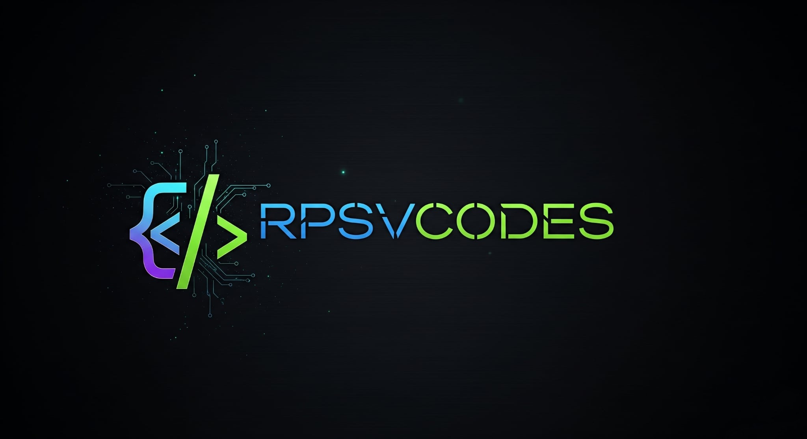

# 👨‍💻 Redjan Phil S. Visitacion

  

---

## 💼 About Me

- 🎯 Aspiring **Frontend Developer**
- 📸 Passionate **Photographer & Editor**
- 📚 Lifelong Learner & Tech Explorer
- 💡 Focused on creating **beautiful, functional web experiences**
- 🌐 Portfolio: [RPSV CODES Landing Page](https://redjanvisitacion.github.io/VISITACION-LANDING-PAGE/RPSV_CODES)

---

## ⚙️ Tech Stack

### 💻 Languages & Frameworks

### 🧰 Frameworks & Tools

### 🎨 Creative Tools

---

## 🌐 Connect With Me

---

## 📊 GitHub Stats

  
  

---

## 🏆 GitHub Trophies

  

---

## 🐍 Contribution Graph Animation

<picture align="center">
  <source media="(prefers-color-scheme: dark)" srcset="https://github.com/RedjanVisitacion/RedjanVisitacion/blob/output/github-snake-dark.svg" />
  <source media="(prefers-color-scheme: light)" srcset="https://github.com/RedjanVisitacion/RedjanVisitacion/blob/output/github-snake.svg" />
  
</picture>

---

## 👁️ Profile Views

  

---

---

  
Built with ❤️ by <a href="https://web.facebook.com/profile.php?id=100080078753987" target="_blank"><strong>Redjan Phil S. Visitacion</strong></a>

