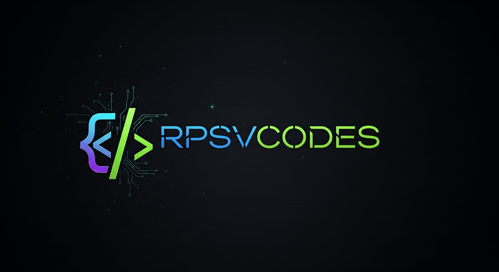

# Redjan Phil S. Visitacion

  

  
  
  

  

## About Me

I am an aspiring frontend developer focused on building clean, responsive, and user-friendly web experiences. I also work with photography and editing, which helps me bring a stronger visual sense into the interfaces I create.

- Building: Frontend projects, landing pages, and web interfaces
- Learning: JavaScript, Flutter, backend tools, and cloud fundamentals
- Creative work: Photography, editing, layout design, and visual branding
- Portfolio: [RPSV Codes Landing Page](https://redjan.vercel.app)

## Tech Stack

### Languages & Frameworks

### Backend, Cloud & Infrastructure

### Design & Productivity

## Skill Progress

| Area | Progress |
| --- | --- |
| HTML / CSS |  |
| JavaScript |  |
| Java |  |
| C# |  |
| Dart / Flutter |  |

## GitHub Analytics

  
  

  

  

## GitHub Trophies

  

## Contribution Graph

  <picture>
    <source media="(prefers-color-scheme: dark)" srcset="https://github.com/RedjanVisitacion/RedjanVisitacion/blob/output/github-snake-dark.svg" />
    <source media="(prefers-color-scheme: light)" srcset="https://github.com/RedjanVisitacion/RedjanVisitacion/blob/output/github-snake.svg" />
    
  </picture>

## Connect With Me

  
  
  
  
  

  

  Built by <a href="https://web.facebook.com/profile.php?id=100080078753987"><strong>Redjan Phil S. Visitacion</strong></a>

