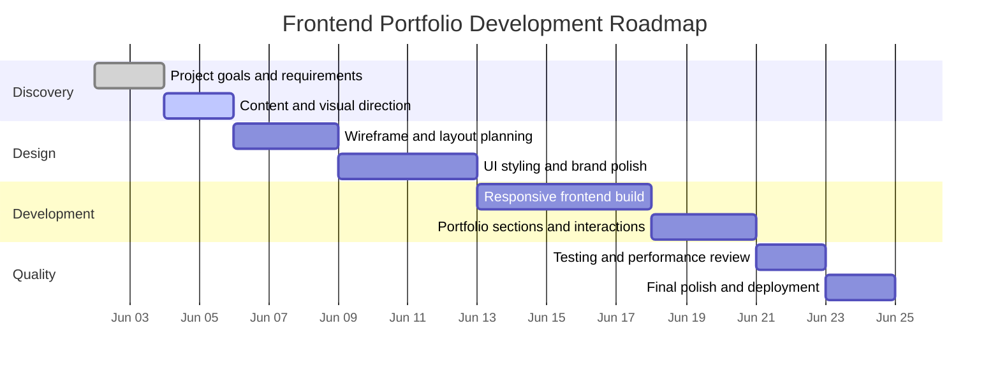
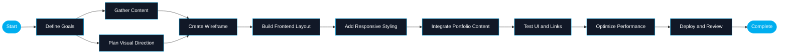

  

<h1 align="center">Redjan Phil S. Visitacion</h1>

  <strong>Aspiring Frontend Developer</strong> focused on clean interfaces, responsive layouts, and polished digital experiences.

  
  

  

---

## Professional Profile

I build web interfaces with a focus on clarity, usability, and visual polish. My creative background in photography and editing helps me approach frontend development with a strong sense of layout, composition, and user experience.

  <table>
    <thead>
      <tr>
        <th>Focus Area</th>
        <th>What I Bring</th>
      </tr>
    </thead>
    <tbody>
      <tr>
        <td><strong>Frontend Development</strong></td>
        <td>Responsive layouts, clean structure, and user-friendly interface design</td>
      </tr>
      <tr>
        <td><strong>Creative Direction</strong></td>
        <td>Photography, editing, visual branding, and content presentation</td>
      </tr>
      <tr>
        <td><strong>Continuous Growth</strong></td>
        <td>JavaScript, Flutter, backend fundamentals, and cloud tools</td>
      </tr>
      <tr>
        <td><strong>Portfolio</strong></td>
        <td><a href="https://redjan.vercel.app">redjan.vercel.app</a></td>
      </tr>
    </tbody>
  </table>

---

## Core Skills

  
  
  
  

## Technology Stack

### Languages & Frameworks

### Backend, Cloud & Infrastructure

### Design & Productivity

---

## Skill Progress

  <table>
    <thead>
      <tr>
        <th>Skill</th>
        <th>Level</th>
      </tr>
    </thead>
    <tbody>
      <tr>
        <td><strong>HTML / CSS</strong></td>
        <td></td>
      </tr>
      <tr>
        <td><strong>JavaScript</strong></td>
        <td></td>
      </tr>
      <tr>
        <td><strong>Java</strong></td>
        <td></td>
      </tr>
      <tr>
        <td><strong>C#</strong></td>
        <td></td>
      </tr>
      <tr>
        <td><strong>Dart / Flutter</strong></td>
        <td></td>
      </tr>
    </tbody>
  </table>

---

## Project Planning

### Development Gantt Chart

```mermaid
gantt
    title Frontend Portfolio Development Roadmap
    dateFormat  YYYY-MM-DD
    axisFormat  %b %d

    section Discovery
    Project goals and requirements      :done,    req, 2026-06-02, 2d
    Content and visual direction        :active,  dir, after req, 2d

    section Design
    Wireframe and layout planning       :         wire, after dir, 3d
    UI styling and brand polish         :         ui, after wire, 4d

    section Development
    Responsive frontend build           :         dev, after ui, 5d
    Portfolio sections and interactions :         inter, after dev, 3d

    section Quality
    Testing and performance review      :         qa, after inter, 2d
    Final polish and deployment         :         deploy, after qa, 2d
```

### PERT Chart

```mermaid
flowchart LR
    A([Start]) --> B[Define Goals]
    B --> C[Gather Content]
    B --> D[Plan Visual Direction]
    C --> E[Create Wireframe]
    D --> E
    E --> F[Build Frontend Layout]
    F --> G[Add Responsive Styling]
    G --> H[Integrate Portfolio Content]
    H --> I[Test UI and Links]
    I --> J[Optimize Performance]
    J --> K[Deploy and Review]
    K --> L([Complete])

    classDef startEnd fill:#00AEEF,color:#ffffff,stroke:#00AEEF;
    classDef task fill:#111827,color:#ffffff,stroke:#00AEEF;
    class A,L startEnd;
    class B,C,D,E,F,G,H,I,J,K task;
```

---

## GitHub Analytics

  

  

## GitHub Trophies

  

## Contribution Graph

  <picture>
    <source media="(prefers-color-scheme: dark)" srcset="https://github.com/RedjanVisitacion/RedjanVisitacion/blob/output/github-snake-dark.svg" />
    <source media="(prefers-color-scheme: light)" srcset="https://github.com/RedjanVisitacion/RedjanVisitacion/blob/output/github-snake.svg" />
    
  </picture>

---

## Connect With Me

  
  
  
  

  

  Built by <a href="https://web.facebook.com/profile.php?id=100080078753987"><strong>Redjan Phil S. Visitacion</strong></a>

